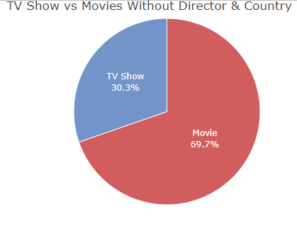
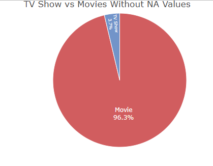

```{r setup, include=FALSE}
knitr::opts_chunk$set(
	echo = TRUE,
	message = FALSE,
	warning = FALSE
)
knitr::opts_knit$set(root.dir = "C:/Users/Facundo/Desktop/UNO/DS/ETL/Netflix/Dataset")
```

| **ETL (Extraer, Transformar, Cargar)**
| 
| **El siguiente documento tiene como objetivo explicar el proceso de ETL realizado en base a mis conocimientos actuales, el resultado obtenido puede no ser muy bueno en su totalidad, en caso de encontrar fallas en el analisis la documentacion queda adjuntada con el codigo realizado en RStudio para su correccion de parte de cualquier persona que posea los conocimientos adecuados.**

**Primero cargamos las bibliotecas y el set de datos.**

```{r message=FALSE, warning=FALSE, paged.print=FALSE}

library(tidyquant)
library(readr)
library(plotly)
library(webshot)
library(orca)
library(corrplot)
library(dplyr)

datanet <- read_csv("netflix1.csv")
```

\-\--

**El set de datos tiene origen del servicio de Streaming "Netflix" donde se almacenan de forma historica las series y peliculas que se fueron añadiendo al catalogo, los datos con los que contamos son: Id del programa, tipo de programa (Serie de TV o Pelicula), director, pais de origen, fecha de adhesion a la plataforma, fecha de filmacion original del programa, clasificacion, duracion del programa y genero.**

```{r message=FALSE, warning=FALSE}
head(datanet)
```

\-\--

**Una vez aclarado el contexto del entorno de trabajo continuemos con el analisis.**

\-\--

**Normalizamos las informacion estandarizando el nombre de las variables de ingles a español y convirtiendo el tipo de dato.**

```{r message=FALSE, warning=FALSE, paged.print=FALSE}
datanet_names<-c("Id_Programa","Tipo","Titulo","Director","Pais"
             ,"Fecha_Adhesion","Año_de_lanzamiento","Clasificacion"
             ,"Duracion","Genero")

names(datanet) <- datanet_names

datanet$Id_Programa <- as.character(datanet$Id_Programa)
datanet$Tipo <- as.character(datanet$Tipo)
datanet$Titulo <- as.character(datanet$Titulo)
datanet$Director <- as.character(datanet$Director)
datanet$Pais <- as.character(datanet$Pais)
datanet$Fecha_Adhesion <- as.Date(datanet$Fecha_Adhesion, format ="%m/%d/%Y")
datanet$Año_de_lanzamiento <- as.numeric(datanet$Año_de_lanzamiento)
datanet$Clasificacion <- as.character(datanet$Clasificacion)
datanet$Duracion <- as.character(datanet$Duracion)
datanet$Genero <- as.character(datanet$Genero)
```

\-\--

**Aqui hay algo interesante, con el metodo sapply verificamos si existen valores nulos en nuestro set de datos y en primera instancia parece que no hay evidencia de ello.**

```{r}
datanetNA <- datanet

sapply(datanetNA, function(x) sum(is.na(x)))
```

\-\--

**Pero si indagamos un poco mas podemos observar que en las columnas Director y Pais existen observaciones con el valor "Not Given" o no dado esto se puede considerar como un valor NULO.**

```{r}
print(datanetNA[c(34,53),c(4,5)])

print(any(datanet$Director == 'Not Given' | datanet$Pais == "Not Given")) #TRUE
```

\-\--

**Identificados dichos valores los transformarmos a tipo 'NA' para luego ser eliminados.**

```{r}

datanetNA$Director[datanetNA$Director == 'Not Given'] <- NA 
datanetNA$Pais[datanetNA$Pais == 'Not Given'] <- NA 

print(datanetNA[c(34,53),c(4,5)])

sapply(datanetNA, function(x) sum(is.na(x)))
```

\-\--

**Importante: si sacamos el total de NA's de cada variable dividido el numero de observaciones podemos ver el porcentaje total que representa esos NA's por variable siendo un 29% para Director y un 3% para Pais.**

```{r}
sum(is.na(datanetNA$Director))/nrow(datanetNA) #0.29
sum(is.na(datanetNA$Pais))/nrow(datanetNA) #0.03
```

\-\--

**Si hacemos cuentas vemos que se pierde un 32.70% de la informacion total esto se obtiene haciendo la diferencia entre el total de los datos originales y los datos eliminados dividido el total de observaciones multiplicado por 100.**

```{r}
datanet_clean1 <- na.omit(datanetNA) # 32.70%
```

\-\--

**Otra alternativa si se quiere resguardar la informacion podria ser remover las variables mencionadas.**

```{r}
datanet_clean2 <- datanetNA[,-c(4,5)] # 0.0%
```

\-\--

**Para concluir en proceso de Extraccion, Transformacion y Cargado es una tarea compleja para garantizar la calidad de los datos a la hora de realizar un analisis y toma de decisiones, en el camino podremos encontrarnos con diversas tareas como la estandarizacion de formatos, la eliminacion de valores nulos, deteccion de errores, etc. El exito de este proceso dependera mucho de las herramientas y las tecnicas que se vayan a utilizar para convertir los datos crudos en informacion valiosa para la toma decisiones de la empresa.**

**Como un Extra adjunto un grafico de tarta realizado con plotly junto a su codigo comentado:**

```{r message=FALSE, warning=FALSE}
#fig1 <- plot_ly(data = datanet_clean1, labels = ~type, values = ~length
#(datanet_clean1$type), type = 'pie',
#               textposition = 'inside',
#               textinfo = 'label+percent',
#               insidetextfont = list(color = '#FFFFFF'),
#               hoverinfo = 'text',
#               marker = list(colors = colors,
#                             line = list(color = '#FFFFFF', width = 1)),
               #The 'pull' attribute can also be used to create space between the sectors
#               showlegend = FALSE)

#fig1 <- fig1 %>% layout(title = 'TV Show vs Movies Without NA Values',
#                      xaxis = list(showgrid = FALSE, zeroline = FALSE,

#showticklabels = FALSE),

#                      yaxis = list(showgrid = FALSE, zeroline = FALSE, 
# showticklabels = FALSE))

#fig1


# fig2 <- plot_ly(data = datanet_clean2, labels = ~type, values = ~length
# (datanet_clean2$type), type = 'pie',
#               textposition = 'inside',
#               textinfo = 'label+percent',
#               insidetextfont = list(color = '#FFFFFF'),
#               hoverinfo = 'text',
#               marker = list(colors = colors,
#                             line = list(color = '#FFFFFF', width = 1)),
               #The 'pull' attribute can also be used to create space between the sectors
#               showlegend = FALSE)

# fig2 <- fig2 %>% layout(title = 'TV Show vs Movies Without Director & Country',
#                      xaxis = list(showgrid = FALSE, zeroline = FALSE,

# showticklabels = FALSE),
#                      yaxis = list(showgrid = FALSE, zeroline = FALSE,

# showticklabels = FALSE))

# fig2
```

{width="251"}

{width="251"}
